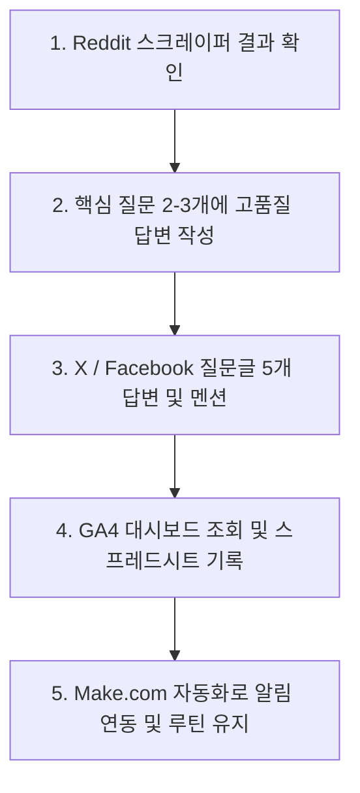

# NomadGuard AI 4주 검증 & 배포(Distribution) 실행 계획서

이 계획서는 NomadGuard AI의 초기 시장 검증(스모크 테스트) 및 유입(Distribution) 활성화를 위해 4주 동안 매일 수행할 실행 루틴과 평가지표를 정의합니다.

> [!IMPORTANT]
> **핵심 전제: 4주 안에 SEO(검색엔진 최적화)는 불가능합니다.**
> 초기 트래픽의 100%는 커뮤니티(Reddit, Facebook, Slack/Discord 등)에서 직접 발로 뛰어 확보해야 합니다. 즉, 이번 4주간의 본업은 **"개발"이 아니라 "매일 커뮤니티에 들어가 글을 쓰고 소통하는 것"**입니다.

---

## 📅 주차별 실행 계획 (Weekly Roadmap)

### 1주차: 출시 준비 (개발 동결 및 인프라 구축)
1주차 일요일까지 사이트 라이브 배포 및 연동 완료가 목표입니다. **이후 추가 개발은 일절 금지합니다.**

* **[ ] 서비스 배포 (Hosting)**
  - 현재 파일 구조(HTML, CSS, JS) 그대로 **Vercel** 또는 **Cloudflare Pages**를 이용해 배포합니다.
  - 보유하고 있는 노는 도메인이 있다면 임시로 연결합니다 (반나절 소요).
* **[ ] 가짜 체크아웃 폼 연동 (Form Integration)**
  - 요금제 "Get Started" 버튼 클릭 시 결제창으로 가는 대신, **"출시 알림 받기 + 무료 리포트 PDF 제공"** 문구의 이메일 수집 폼을 노출합니다.
  - **Tally** 또는 **Formspark**를 사용해 폼 데이터 전송을 완료합니다. (WTP 검증 핵심 장치)
* **[ ] 어필리에이트 프로그램 가입**
  - **SafetyWing 앰배서더**에 즉시 가입하여 실링크를 연동합니다 (가입 절차 간단, 건당 ~$20 커미션).
  - 추후 **TFX (Expat Tax)** 또는 **Heymondo** 제휴를 신청하되, 1주차에는 SafetyWing 단일 링크만으로 검증을 시작합니다.
* **[ ] GA4 및 트래킹 스크립트 연결**
  - `nomadguard.js`의 `track()` 함수에 GA4를 연동하여 5대 퍼널 이벤트가 정상 적재되는지 검증합니다.
* **[ ] A/B HUD 관리 확인**
  - 디버그 HUD가 주소창에 `?debug=1`을 입력할 때만 뜨는지 다시 확인하여 방문자들의 신뢰 손상을 방지합니다.

> [!CAUTION]
> **1주차 이후 절대 하지 말아야 할 것:**
> - React/Next.js 전환 작업
> - 리팩토링 및 아키텍처 개선
> - 국가 데이터 추가 (Spain, Thailand, Germany, Sweden 4개국 유지)
> - 디자인 디테일 개선

---

### 2~4주차: 배포 & 커뮤니티 빌딩 (매일 30분~1시간)
확보하고 있는 **Reddit 페인포인트 스크레이퍼** 자산을 적극 활용하여 매일 아래의 루틴을 진행합니다.

#### 📌 채널 A: Reddit (핵심 채널)
- **대상 서브레딧**: `r/digitalnomad` (200만+), `r/expats`, `r/tax`, `r/ExpatFIRE`
- **전략**: **"답변을 먼저 작성하고, 링크는 나중에 넣는다"** (홍보 직후 밴 방지)
  1. 스크레이퍼를 `"183 days"`, `"tax residency"`, `"double taxation"`, `"visa overstay"`, `"Spain DNV"` 등의 키워드로 매일 가동하여 질문 글을 수집합니다.
  2. 질문 글에 영문으로 진짜 도움이 되는 고품질 답변을 작성합니다 (Claude 초안 작성 ➡️ 개인적인 톤으로 수정).
  3. 계정 카르마가 쌓인 2주차 후반부터 답변 마지막에 "비슷한 고민을 해결하기 위해 만든 무료 계산 툴"이라며 자연스럽게 링크를 남기거나, DM을 요청한 유저에게 직접 발송합니다.
  4. 3주차에는 "183일 세금 리스크를 계산해 주는 툴을 만들었는데, 피드백을 달라(Roast it)"는 형태의 피드백 포스트를 `r/digitalnomad`에 1회 게시합니다.

#### 📌 채널 B: Facebook 그룹 & 국내 채널
- **대상**: `"Digital Nomads Around the World"`(20만+), 지역별 노마드 그룹 (`Expats in Spain`, `Thailand Digital Nomads` 등).
- **전략**: Reddit과 동일하게 세금/비자 관련 질문 답변 위주로 활용하며, 주 1회 정도 툴 링크를 언급합니다.
- **국내 채널**: `디지털노마드 한국` 네이버 카페 및 카카오톡 오픈채팅방에 테스트 용도로 배포해 봅니다.

#### 📌 채널 C: X (트위터) 핀포인트 멘션
- X에서 `#digitalnomad` 및 세금 질문 태그를 모니터링하여, 질문 글에 하루 5개 이상 멘션으로 답변과 링크를 남깁니다.

---

## 📈 매일의 루틴 (Daily Routine: 30~45분)

> [!TIP]
> **주특기 활용 자동화**:
> Reddit 스크레이퍼를 **Make.com**과 연동하여, 매일 아침 수집된 질문 목록과 답변 후보 스레드를 본인의 카카오톡 또는 이메일로 받아보게 설계하세요. 매일 커뮤니티를 검색하는 수고를 덜어 루틴 유지율이 극대화됩니다.

---

## ⚖️ 4주 완료 시점 판정 기준 (Kill / Proceed Criteria)

4주가 종료되는 시점(방문자 수 500명 이상 유입 후)에 냉정하게 프로젝트의 생존 여부를 채점합니다.

| 시나리오 | 검증 결과 | 판정 및 액션 플랜 |
| :--- | :--- | :--- |
| **시나리오 1 (성공)** | **방문 500+ / 이메일 30+ / 어필 CTR 5%+** | **속행 (Proceed)** 수집된 이메일 대상 유료 컨설팅/리포트 제안 메일 발송 및 정식 SEO 콘텐츠 제작 착수. |
| **시나리오 2 (보류)** | **방문은 500+ 이상이나 이메일/클릭 전환 부족** | **메시지 피벗 (Pivot)** 진단 리포트 카피 및 무료 리포트 제공 오퍼를 1회 변경하여 2주간 연장 테스트 진행. |
| **시나리오 3 (실패)** | **방문자 유입 자체가 200명 미만** | **자가 판정 불가 (Routine Failure)** 제품의 문제가 아니라 4주간의 배포 루틴을 이행하지 않은 배포의 실패입니다. 루틴 유지 실패 원인을 복기하거나 아이디어를 킬(Kill) 합니다. |

---

> [!IMPORTANT]
> 이 계획은 **"아침 출근 전 30분"**과 같이 루틴을 고정해두고 시공 현장 업무 스케줄과 겹치지 않게 방어적으로 관리해야 완수할 수 있습니다. 1주차 연동 및 세팅 과정 중 막히는 부분이 생기면 언제든 질문해 주세요!
